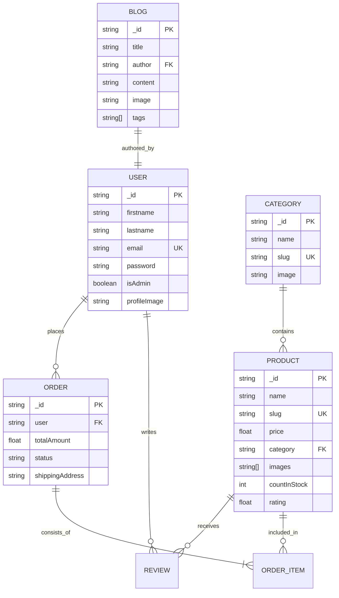

# YUMI Cosmetic Shop — Luxury E-Commerce MVP

A premium, full-stack cosmetic shop application built with a focus on editorial design, luxury aesthetics, and high-performance administrative management.

## 💎 Project Overview
YUMI is designed to provide a high-end shopping experience for skincare and beauty enthusiasts. It combines a sophisticated storefront with a powerful Administrative Dashboard, allowing brand curators to manage their entire inventory, editorial content, and customer relationship with ease.

---

## 🚀 Key Features

### 🛍️ Luxury Storefront
- **Elegant Navigation**: Smooth, responsive header and footer with intuitive categorization.
- **Editorial Journal**: A dedicated blog section for "Self-Care Stories" and skincare science.
- **Dynamic Product Grid**: Highly filterable product catalog with "Best Sellers" and "Curated" highlights.
- **Personalized Recommendations**: AI-driven "Beauty Concierge" for tailored skincare routines.
- **Integrated Cart & Checkout**: Seamless shopping bag experience with secure order placement.

### 🛡️ Administrative Suite (The "Vault")
- **Full CRUD Management**: Comprehensive Add/Edit/Delete workflows for **Products**, **Categories**, and **Blogs**.
- **High-Performance Pagination**: Server-side pagination and search for handling thousands of records efficiently.
- **Administrative CRM**: List and manage all registered users and their details.
- **Order Ledger**: Real-time tracking and status management for all customer orders.
- **Premium UX**: Glassmorphism, luxury transitions, and a "Curator-focused" UI.

### 🔑 Security & Performance
- **Role-Based Access Control (RBAC)**: Secure admin paths protected by specialized middleware.
- **JWT Authentication**: Persistent and secure custom login/status tracking.
- **Lazy Loading & Code Splitting**: Optimized frontend bundle for fast initial loads.

---

## 🛠️ Technology Stack

| Layer | Technologies |
| :--- | :--- |
| **Frontend** | React 19, TypeScript, Vite, Tailwind CSS |
| **State Management** | Redux Toolkit (Thunks), Context API |
| **Backend** | Node.js, Express.js |
| **Database** | MongoDB (Atlas), Mongoose |
| **Styling** | Shadcn/UI, Lucide React, Glassmorphism CSS |
| **Image Hosting** | Cloudinary (Integrated) |
| **Deployment** | Git/GitHub Flow |

---

## 🗺️ System Flow

### **1. Public User Journey**
1. **Landing**: User arrives at the Home Page (Hero + Featured Sections).
2. **Discovery**: User explores the Shop or Reads an Editorial Blog.
3. **Personalization**: User takes a "Beauty Concierge" quiz for recommendations.
4. **Acquisition**: User adds products to the Cart and proceeds to Checkout.
5. **Session**: Registered users can track orders, view favorites, and manage profiles.

### **2. Administrator Flow**
1. **Auth**: Admin logs in using highly-restricted credentials.
2. **Access**: Navbar redirects Admin to the **Admin Dashboard** (hidden from regular users).
3. **Curation**: Admin manages the "Vault" (Inventory, Categories, and Editorial content).
4. **Fulfillment**: Admin reviews and updates shipping statuses in the Order Ledger.

---

## 📊 Database Schema (ERD)

---

## 📍 Route Map

### **Frontend (Client)**
- `/`: Home (Hero, Featured, Blog Teasers)
- `/shop`: Full catalog with advanced filtering
- `/product/:slug`: Deep-dive into product details
- `/category/:slug`: Collection-specific views
- `/blog`: All editorials and journal entries
- `/admin`: Dashboard (Root for administrative tools)
- `/profile`: User account management

### **Backend (API)**
- `GET /api/products`: Full list with server-side pagination
- `POST /api/admin/products`: Secure product creation
- `GET /api/categories`: Fetch all organizational structures
- `GET /api/blogs`: Fetch paginated editorial content
- `POST /api/auth/login`: Secure credential validation

---

## 🔮 Future Implementations
- **Live Inventory Sync**: Webhook integration for real-time stock alerts.
- **Advanced Subscription**: Recurring "Beauty Box" delivery options for users.
- **AR Virtual Try-On**: Integrating Augmented Reality for testing colors on-camera.
- **Multilingual Support**: Professional localized translations (FR, JP, KO).
- **Automated Invoicing**: PDF generator for customer order confirmations.

---

## 🚀 Getting Started
1. **Clone the Repo**: `git clone https://github.com/yumi-2003/MVP-cosmetic-web-app.git`
2. **Install Dependencies**: `npm install` in both `client` and `server` folders.
3. **Env Setup**: Configure your `MONGO_URI` and `CLOUDINARY` keys in `server/.env`.
4. **Run Dev Server**: `npm run dev` in both directories.

---
*Created with ❤️ by the YUMI Core Team.*
